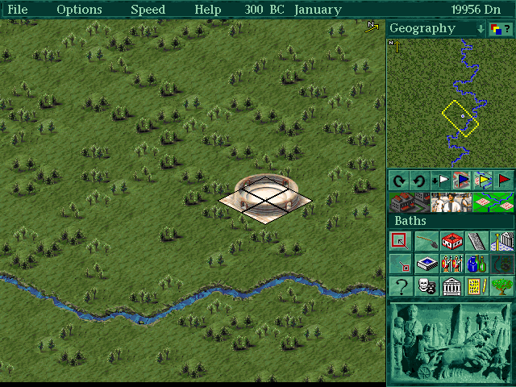
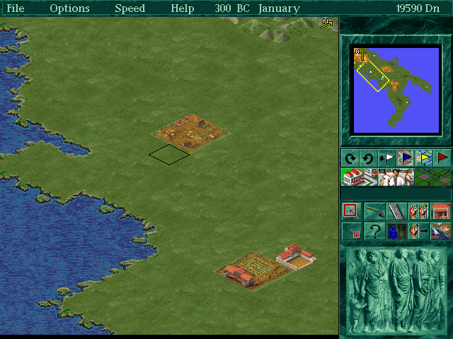
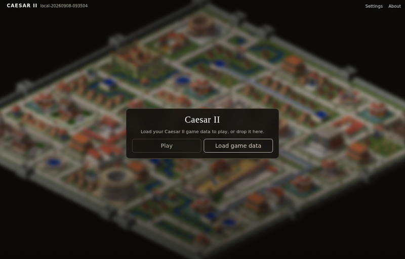
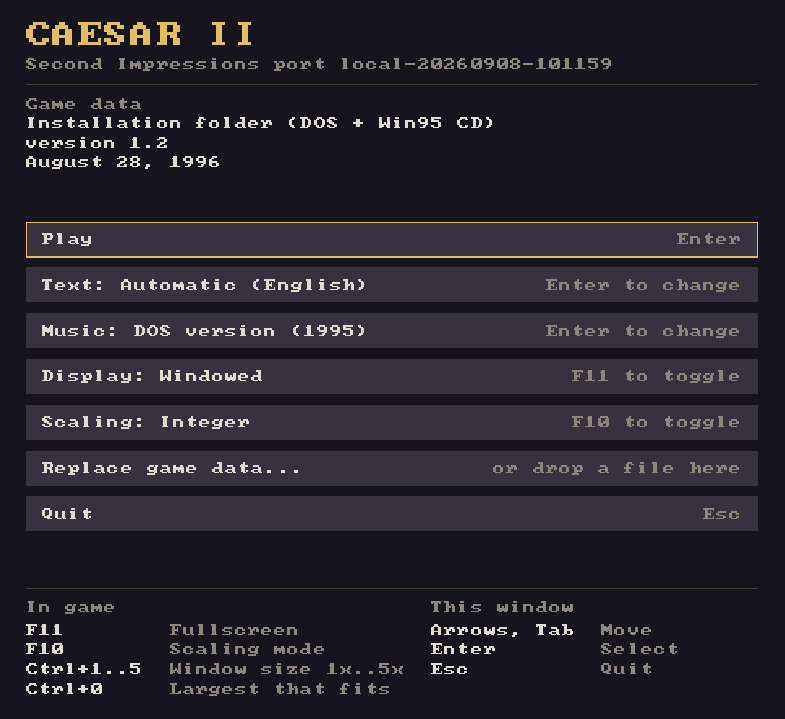

# Caesar II

Caesar II (1995) running natively on Linux, Windows, macOS and in a browser.
There is no DOSBox and no emulator underneath: the game's own code was
recovered from the original executable and made to build for current systems.

[](docs/screenshots/city.png)

Playing with the game's German text. English and French are built in as well.

| | |
|---|---|
| [](docs/screenshots/province.png) | [](docs/screenshots/web.png) |
| The province map | The same game in a browser |

## Play it in three steps

1. **Get the game.** Caesar II is sold DRM-free on
   [GOG](https://www.gog.com/en/game/caesar_ii) for a few euros. An original
   CD, a disc image or an old installation works just as well. The port never
   ships game data.
2. **Get the port.** Open [the browser
   version](https://second-impressions.github.io/caesar2-port/), which needs
   no installation, or download for your system from the [releases
   page](https://github.com/second-impressions/caesar2-port/releases):
   `.AppImage` or `.flatpak` for Linux, `.zip` for Windows (unzip anywhere and
   run `caesar2.exe`), `.dmg` for macOS.
3. **Point it at your copy and press Play.** A small launcher opens first. Give
   it your disc, image or game folder; it imports the data once and remembers
   where it came from.



## What you get

The engine is the original one, so the game plays as it did in 1995, down to
its balance and its quirks, and save files from the original load. Around it,
this port provides:

- a resizable window, fullscreen, sharp integer scaling and screenshots, with
  nothing to configure in a text file;
- the same game in a browser, built from the same code, with your game data
  kept in the browser's storage on your own machine;
- English, German and French text, chosen in the launcher, while speech and
  pictures come from your game data. Translations are ordinary gettext files
  under `po/`; see [docs/game-text.md](docs/game-text.md) if you want to add
  one;
- both soundtracks. The 1995 DOS music plays through a reimplementation of the
  Sound Blaster's OPL3 chip and follows your city's mood; the discs from
  August 1996 onwards also carry the recorded 1996 Windows soundtrack, which
  is different music.

## Where your copy can come from

Any of these works, natively or in the browser. The importer looks inside and
works out what it has:

- an installed game folder, whether GOG's or an old DOS or Windows
  installation (pick any file inside it, for example `C2.ENG`); for GOG's
  DOS release the importer automatically uses its complete `game.gog` CD image,
- the original CD-ROM in a drive, which the launcher lists when one is
  inserted,
- a disc image: `.iso`, or `.bin` with or without its `.cue`, also inside a
  `.zip`,
- a `.zip` of an installed folder,
- a `.c2assets` pack, which can carry several languages of speech in one file
  (`tools/c2-assets.py build`, see [docs/localization.md](docs/localization.md)).

Disc images and archives are imported once and reused on later starts. Saves,
screenshots and settings live in the same place:

| | |
|---|---|
| Linux | `~/.local/share/second-impressions/caesar2` |
| Linux, Flatpak | `~/.var/app/io.github.second_impressions.caesar2/data/second-impressions/caesar2` |
| Windows | `%APPDATA%\second-impressions\caesar2` |
| macOS | `~/Library/Application Support/second-impressions/caesar2` |
| Browser | the browser's own storage for the page |

The original installer copied only part of the game to the hard disk, so an
installation folder without `XMI/` and `RAW/` has no music or speech. The
launcher and the web page say so when they see it; use the disc or an image of
it to get everything. GOG installations are complete: their `game.gog` file
is the original CD image, and the importer reads it automatically.

## Keys and options

Hotkeys, mouse and menus inside the game are the original's, so its manual
still applies. The port adds these:

| Key | Action |
|---|---|
| **F11** | fullscreen |
| **F10** | integer / fractional scaling |
| **Ctrl+1** … **Ctrl+5** | window at exactly 1x … 5x |
| **Ctrl+0** | window at the largest multiple that fits the screen |
| Mouse wheel | zoom (the game's own `+`/`-`) |
| **Alt+1** … **Alt+8** | screenshot `shot1.png` … `shot8.png` into the user-data directory |

The game is 640x480. The window opens at the largest whole multiple that fits
your desktop and can be resized freely. Integer scaling, the default, keeps
square pixels and leaves a border until the next multiple fits; fractional
scaling fills the window instead. Both settings are remembered.

On the command line, `caesar2 [SOURCE]` starts with a given game-data source.
The other options are `--fullscreen`, `--fractional-scaling`,
`--skip-launcher`, `--mouse-lock` (confine the pointer to the game area),
`--user-data-dir PATH`, `--language TAG` (`en`, `de`, `fr`), `--music
dos|windows`, `--asset-profile NAME` (speech in a multi-profile pack) and
`--version`.

## Something wrong?

Open an [issue](https://github.com/second-impressions/caesar2-port/issues/new/choose).
The form asks for the few things that make a report usable.

## How this works

The engine was not rewritten. It was recovered as C source in the
[Caesar II reconstruction](https://github.com/second-impressions/caesar2-reconstruction),
whose build reproduces the 1995 executable byte for byte. This repository
continues that source onto SDL3: the DOS and Windows calls the game made are
replaced one function at a time, the game's own logic is left alone, and each
deliberate difference is a named flag in `include/c2_target.h`.

The music, the movies and the file formats needed code of their own, written
for this port: an XMIDI sequencer with an OPL3 synthesizer, Smacker video
playback and the game-data importer. They are described under [docs/](docs/).

## Building

```bash
nix develop            # or install the dependencies below yourself
cmake --preset linux-release
cmake --build --preset linux-release
./build/port/linux-release/caesar2
```

Every library comes from the build host. CMake locates them, nothing is
fetched or bundled, and there are no git submodules, so a release tarball
builds as it is:

| Library | Needed for | Required |
|---|---|---|
| SDL3 ≥ 3.4 | window, input, audio, filesystem | yes |
| zlib | Deflate in the ZIP importer | yes |
| libbacktrace | source lines in crash reports (`-DPORT_WITH_LIBBACKTRACE=AUTO\|ON\|OFF`) | no |
| Unity | the C test suite (`BUILD_TESTING`) | tests only |

Two decoders that no distribution packages are carried as plain files with
their provenance in [third_party/README.md](third_party/README.md): libsmacker
(Smacker video) and Nuked OPL3 (the FM chip). Packagers should declare them as
bundled.

`cmake --install` lays out the binary, desktop entry, AppStream metainfo, icon
and licenses under the usual `GNUInstallDirs`, honouring `DESTDIR`:

```bash
cmake -S . -B build -DCMAKE_BUILD_TYPE=Release -DPORT_WITH_LIBBACKTRACE=ON
cmake --build build
DESTDIR=/tmp/stage cmake --install build --prefix /usr
```

The `windows-msvc-*` presets take their libraries from the vcpkg manifest
(`vcpkg.json`), and the web build is described in
[docs/webassembly.md](docs/webassembly.md). Every configuration, releases
included, carries debug information. A release build reports its version as
`1.0.2`; other builds name their origin and commit, such as `main-a630e29c`.

## Developing

Recovered engine C stays in `src/`, CPU-only translations of recovered
assembly in `src/asm/`, backend-neutral shims in `src/platform/common/`, and
host backends in `src/platform/<backend>/`. Target differences go through
`include/c2_target.h` (`PORT_PLATFORM`, `PORT_FIX_*`, `PORT_FEAT_*`) rather
than raw compiler macros. The original's behaviour, bugs included, is the
default, and every deviation is a named, documented flag.

- [docs/testing.md](docs/testing.md): smoke tests that play the game through
  the real input path, the sanitizer presets, crash reports
- [docs/platform-boundary.md](docs/platform-boundary.md): the audited
  function, subsystem and assembly boundary
- [docs/engine-scheduling.md](docs/engine-scheduling.md): worker thread, frame
  publication, input and browser scheduling
- [docs/timing.md](docs/timing.md): the original timing mechanisms and their
  portable counterparts
- [docs/media-implementation.md](docs/media-implementation.md): PCM, Smacker
  and the XMIDI/OPL3 music stack, and the two soundtracks
- [docs/game-data-sources-plan.md](docs/game-data-sources-plan.md),
  [docs/native-data-paths.md](docs/native-data-paths.md),
  [docs/user-data.md](docs/user-data.md): data import, caching, user files
- [docs/game-text.md](docs/game-text.md): the compiled-in text and its gettext
  files, and [docs/localization.md](docs/localization.md) for speech and packs
- [docs/releasing.md](docs/releasing.md): how a release is cut and what it
  contains
- [docs/legacy-abi.md](docs/legacy-abi.md) and
  [docs/recovered-source-delta-audit.md](docs/recovered-source-delta-audit.md):
  compiler semantics the recovered code relies on, and every port edit to a
  recovered file
- [docs/reconstruction-tooling.md](docs/reconstruction-tooling.md): the
  byte-exact DOS reconstruction tooling still carried here

Byte equality is not a requirement in this repository, but keep inherited
files structurally close to the reconstruction so its advances stay easy to
cherry-pick. Changes are not forwarded back.

## License

Except for third-party components carrying their own notices, this project is
licensed under the [GNU Affero General Public License, version 3 or
later](LICENSE) (`AGPL-3.0-or-later`). It is distributed without warranty.

This license declaration applies to contributions that project contributors
are entitled to license. It does not grant rights to original Caesar II game
assets or other third-party material. Game assets are not distributed by this
project and must be supplied by users from copies they are authorized to use.
Third-party components retain the licenses recorded in their own license and
notice files.
