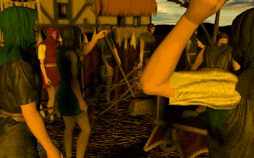

# Smacker playback test — the delinked-object end-to-end proof

This is the "ultimate test" for `c2 delink`: it links the **delinked RAD
Smacker library** (recovered from PS.EXE, never rebuilt from source) into a
small DOS/4GW program that **decodes real `.SMK` videos**.  If the delinked
object were wrong in any relocation, the decoder — 13 KB of hand-written
self-modifying `unsmack.ASM` — would produce garbage.  It produces frames:



(A frame from a RAD Smacker cinematic, decoded start-to-finish by the
delinked `_SmackDoFrameToBuffer` running under DOS/4GW.)

## What it exercises

The full delinked audio/video stack, entirely third-party code recovered by
`c2 delink` (RAD Smacker + RAD file I/O + **Miles AIL** for sound):

```
SmackOpen  ->  _radopen / __qread / blockread        (rfile.ASM + qread)
SmackDoFrame  ->  _SmackDoTables (Huffman trees)      (unsmack.ASM)
              ->  _SmackDoFrameToBuffer (decompress)  (unsmack.ASM, self-modifying)
SmackToBuffer ->  blit descriptor                     (smackinp.cpp)
```

The only non-delinked pieces are: `radmalloc`/`radfree` (thin `malloc`
wrappers, `radmem.c`), a one-line `show_smksum_screen` game stub
(`gamestub.c`), and the Watcom CRT (`clib3r.lib`).  Palette, pixels **and
sound** all come out of delinked library code (`c2 delink --group av` =
Smacker + AIL + RAD file I/O in one object).

## Sound (Miles AIL)

Movie audio plays through the delinked **Miles AIL** library, exactly as the
game wires it: `AIL_startup()` -> `AIL_install_DIG_INI(&dig)` (reads
`DIG.INI` -> `SB16.DIG`, IRQ/DMA auto from the `BLASTER` env) ->
`SetSmackAILDigDriver(dig)` -> `SmackOpen(..., 0x200, ...)`.  `build.sh`
stages `DIG.INI` + `SB16.DIG` from the C2 demo.

Sound needs a real DOS timer/DPMI + Sound Blaster, and — exactly like PS.EXE
itself (see `c2 run`) — the DOSBox-X **normal CPU core** (`core=normal`): the
dynamic recompiler can't execute AIL's DIG driver, which is loaded into a heap
page and jumped into at runtime (`DYNX86: Can't run code in this page`).  AIL
is also timing-sensitive (`cycles=10000`).  Headless dosemu2 can't run it at
all (faults in `AIL_start_timer`'s ISR).  `build.sh` emits `smkplay.conf` with
the `c2 run` audio settings (SB16 + `BLASTER=…T6 P330` + the AIL-v2 DSP
tweaks).  Run with sound:

> **Delink bug that used to crash the DIG driver (fixed):** `AIL_install_DIG_INI`
> would derail into a wild address because `ailssa.asm`'s digital-audio DMA
> dispatch **jump tables** (256 `_DC_*`/`_M_*` pointers in the code image) were
> mis-attributed to the trailing CRT `remove` symbol and dropped by the
> delinker, so the DMA-service `call cs:[eax*4 + TABLE]` read a garbage slot.
> `c2 delink` now recovers these data-in-code tables (see
> `docs/delinking.md` → "Data-in-code jump tables…"); the driver now installs
> and services DMA cleanly (`AIL_install_DIG_INI ok … exit clean`).

```
nix shell nixpkgs#dosbox-x --command dosbox-x -conf /tmp/smktest/smkplay.conf
```

That plays `REAL.SMK` in text `trace` mode with audio + per-frame progress.
For the picture, change the last autoexec line to `playps.exe REAL.SMK vga`.

## Build & run

```bash
tools/smk-player/build.sh /tmp/smktest
cp "some/movie.SMK" /tmp/smktest/MOVIE.SMK
podman run --rm -v /tmp/smktest:/src localhost/watcom-10.0a-dosemu2 play.exe MOVIE.SMK
# -> writes frame000.ppm / frameNNN/2.ppm / frameLAST.ppm  (index->RGB via 6-bit palette)
```

Pass a second arg `vga` to set mode 13h and blit instead of dumping PPMs
(for dosbox-x / real hardware).

`build.sh` also emits **`playps.exe`** — the same program made **exactly
self-contained the way PS.EXE is**: DOS/4GW binding is a pure prefix swap
(the extender stub is prepended, the `LE` left untouched), so `build.sh`
lifts PS.EXE's OWN byte-exact DOS/4GW Professional 1.97 stub
(`data/PS.EXE[:0x37d4c]`) and prepends it to the freshly-linked `LE`.  The
result is a single self-contained file (no external `dos4gw.exe`) with the
exact 228 KB `DOS/4G … Rational` stub PS.EXE boots with — and needs no
vendored `4GWBIND`/`4GWPRO` abandonware.  Run it standalone:

```bash
podman run --rm -v /tmp/smktest:/src localhost/watcom-10.0a-dosemu2 playps.exe MOVIE.SMK
```

## The load-bearing finding: shared `simspeed` scratch

`unsmack.ASM` keeps its decoder state (patched dispatch tables, tree roots,
bitstream pointers) in a ~530-byte file-scope region the `-d1` symbols call
`simspeed` (0x0bd34).  **`qread` overlays its read buffer onto the tail of
that same region** — a classic 1990s memory overlay.  So the two modules
*share* one physical buffer in PS.EXE.

Delinking Smacker and the RAD file I/O into **separate** objects gave each a
private copy of `simspeed`; the decoder then read its state from a different
copy than the one being maintained, and every frame decoded to a degenerate
`1,0,1,0…` pattern (2 colours) even though the palette decoded perfectly.

Fix: delink them **together** (`c2 delink --group smacker rfile.ASM qread`)
so there is one shared `simspeed`.  Decode immediately went 2 → ~180 colours
(real video).  General rule: **modules that share data must be delinked into
one object** (or the shared region exported once and imported), never
duplicated.
